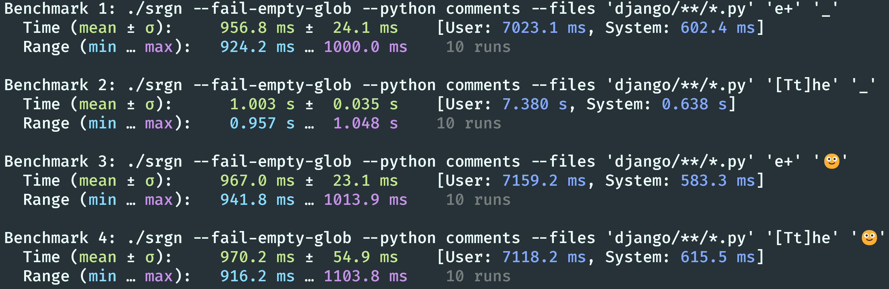

# srgn - a code surgeon

A `grep`-like tool which understands source code syntax and allows for manipulation in
addition to search.

Like `grep`, regular expressions are a core primitive. Unlike `grep`, additional
capabilities allow for **higher precision**, with **options for manipulation**. This
allows `srgn` to operate along dimensions regular expressions and IDE tooling (*Rename
all*, *Find all references*, ...) alone cannot, complementing them.

`srgn` is organized around *actions* to take (if any), acting only within precise,
optionally **language grammar-aware** *scopes*. In terms of existing tools, think of it
as a mix of
[`tr`](https://www.gnu.org/software/coreutils/manual/html_node/tr-invocation.html#tr-invocation),
[`sed`](https://www.gnu.org/software/sed/),
[ripgrep](https://github.com/BurntSushi/ripgrep) and
[`tree-sitter`](https://tree-sitter.github.io/tree-sitter/), with a design goal of
*simplicity*: if you know regex and the basics of the language you are working with, you
are good to go.

## Quick walkthrough

> [!TIP]
>
> All code snippets displayed here are [verified as part of unit tests](tests/readme.rs)
> using the actual `srgn` binary. What is showcased here is guaranteed to work.

The most simple `srgn` usage works [similar to `tr`](#comparison-with-tr):

```bash
$ echo 'Hello World!' | srgn '[wW]orld' 'there' # replacement
Hello there!
```

Matches for the regular expression pattern `'[wW]orld'` (the *scope*) are replaced (the
*action*) by the second positional argument. Zero or more actions can be specified:

```bash
$ echo 'Hello World!' | srgn '[wW]orld' # zero actions: input returned unchanged
Hello World!
$ echo 'Hello World!' | srgn --upper '[wW]orld' 'you' # two actions: replacement, afterwards uppercasing
Hello YOU!
```

Replacement is always performed first and specified positionally. Any [other
actions](#actions) are applied after and given as command line flags.

### Multiple queries

Similarly, more than one query can be specified: in addition to the regex pattern, a
[**language grammar-aware**]((https://tree-sitter.github.io/tree-sitter/)) query can be
given, which scopes to **syntactical elements of source code** (think, for example, "all
bodies of `class` definitions in Python"). If both are given, the regular expression
pattern is then **only applied *within* that first, language scope**. This enables
search and manipulation at precision not normally possible using plain regular
expressions, and serving a dimension different from tools such as *Rename all* in IDEs.

For example, consider this (pointless) Python source file:

```python file=birds.py
"""Module for watching birds and their age."""

from dataclasses import dataclass


@dataclass
class Bird:
    """A bird!"""

    name: str
    age: int

    def celebrate_birthday(self):
        print("🎉")
        self.age += 1

    @classmethod
    def from_egg(egg):
        """Create a bird from an egg."""
        pass  # No bird here yet!


def register_bird(bird: Bird, db: Db) -> None:
    assert bird.age >= 0
    with db.tx() as tx:
        tx.insert(bird)
```

which can be searched using:

```console
$ cat birds.py | srgn --python 'class' 'age'
11:    age: int
15:        self.age += 1
```

The string `age` was sought and found *only* within Python `class` definitions (and not,
for example, in function bodies such as `register_bird`, where `age` also occurs and
would be nigh impossible to exclude from consideration in vanilla `grep`). By default,
this 'search mode' also prints line numbers. **Search mode is entered if no actions are
specified**, and a language such as `--python` is given[^3]—think of it like
'[ripgrep](https://github.com/BurntSushi/ripgrep) but with syntactical language
elements'.

Searching can also be performed [across
lines](https://docs.rs/regex/1.10.5/regex/index.html#grouping-and-flags), for example to
find methods (aka *`def` within `class`*) lacking docstrings:

```console
$ cat birds.py | srgn --python 'class' 'def .+:\n\s+[^"\s]{3}' # do not try this pattern at home
13:    def celebrate_birthday(self):
14:        print("🎉")
```

Note how this does not surface either `from_egg` (has a docstring) or `register_bird`
(not a method, *`def` outside `class`*).

#### Multiple queries

Queries themselves can be specified multiple times as well. For example, in the
Rust snippet

```rust file=music.rs
pub enum Genre {
    Rock(Subgenre),
    Jazz,
}

const MOST_POPULAR_SUBGENRE: Subgenre = Subgenre::Something;

pub struct Musician {
    name: String,
    genres: Vec<Subgenre>,
}
```

multiple items can be surgically drilled down into as

```console
$ cat music.rs | srgn --rust 'pub-enum' --rust 'type-identifier' 'Subgenre' # AND'ed together
2:    Rock(Subgenre),
```

where only lines matching *all* criteria are returned, acting like a logical *and*
between all conditions. Note that conditions are evaluated left-to-right, precluding
some combinations from making sense: for example, searching for a Python `class` body
*inside* of Python `doc-strings` usually returns nothing. The inverse works as expected
however:

```console
$ cat birds.py | srgn --py 'class' --py 'doc-strings' # From earlier example; note `--py` is a shorthand for `--python`
8:    """A bird!"""
19:        """Create a bird from an egg."""
```

No docstrings outside `class` bodies are surfaced!

The [`-j` flag](#help-output) changes this behavior: from intersecting left-to-right, to
running all queries independently and joining their results, allowing you to search
multiple ways at once:

```console
$ cat birds.py | srgn -j --python 'comments' --python 'doc-strings' 'bird[^s]'
8:    """A bird!"""
19:        """Create a bird from an egg."""
20:        pass  # No bird here yet!
```

The pattern `bird[^s]` was found inside of comments *or* docstrings likewise, not just
"docstrings *within* comments".

#### Working recursively

If standard input is not given, `srgn` knows how to find relevant source files
automatically, for example in this repository:

```console
$ srgn --python 'class' 'age'
docs/samples/birds
11:    age: int
15:        self.age += 1

docs/samples/birds.py
9:    age: int
13:        self.age += 1
```

It recursively walks its current directory, finding files based on [file
extensions](docs/samples/birds.py) and [shebang lines](docs/samples/birds), processing
at very high speed. For example, `srgn --go strings '\d+'` finds and prints all ~140,000
runs of digits in literal Go strings inside the [Kubernetes
codebase](https://github.com/kubernetes/kubernetes/tree/5639f8f848720329f4a9d53555a228891550cb79)
of ~3,000,000 lines of Go code within 3 seconds on 12 cores of M3. For more on working
with many files, see [below](#run-against-multiple-files).

### Combining actions and scopes

Scopes and actions can be combined almost arbitrarily (though many combinations are not
going to be use- or even meaningful). For example, consider this Python snippet (for
examples using other supported languages see
[below](#prepared-queries-sample-showcases)):

```python file=gnu.py
"""GNU module."""

def GNU_says_moo():
    """The GNU function -> say moo -> ✅"""

    GNU = """
      GNU
    """  # the GNU...

    print(GNU + " says moo")  # ...says moo
```

against which the following command is run:

```bash
cat gnu.py | srgn --titlecase --python 'doc-strings' '(?<!The )GNU ([a-z]+)' '$1: GNU 🐂 is not Unix'
```

The anatomy of that invocation is:

- `--titlecase` (an [action](#character-casing)) will Titlecase Everything Found In
  Scope
- `--python 'doc-strings'` (a [scope](#language-grammar-aware-scopes)) will scope to
  (i.e., only take into consideration) docstrings according to the Python language
  grammar
- `'(?<!The )GNU ([a-z]+)'` (a [scope](#scopes)) sees only what was already scoped by
  the previous query option, and will narrow it down further. It can never extend the previous
  scope. The regular expression scope is applied after any language scope(s).

  <!-- markdownlint-disable MD038 -->
  `(?<!)` is [negative
  lookbehind](https://docs.rs/fancy-regex/latest/fancy_regex/#syntax) syntax,
  demonstrating how this advanced feature is available. Strings of `GNU` prefixed by
  `The ` will not be considered.
  <!-- markdownlint-enable MD038 -->
- `'$1: GNU 🐂 is not Unix'` (an [action](#replacement)) will *replace* each matched
  occurrence (i.e., each input section found to be in scope) with this string. Matched
  occurrences are patterns of `'(?<!The )GNU ([a-z]+)'` *only within* Python docstrings.
  Notably, this replacement string demonstrates:

  - dynamic [variable binding and substitution](#variables) using `$1`, which carries
  the contents captured by the first capturing regex group. That's `([a-z]+)`, as
  `(?<!The )` is not capturing.
  - full Unicode support (🐂).

The command makes use of multiple scopes (language and regex pattern) and multiple
actions (replacement and titlecasing). The result then reads

```python file=output-gnu.py
"""Module: GNU 🐂 Is Not Unix."""

def GNU_says_moo():
    """The GNU function -> say moo -> ✅"""

    GNU = """
      GNU
    """  # the GNU...

    print(GNU + " says moo")  # ...says moo
```

where the changes are limited to:

```diff
- """GNU module."""
+ """Module: GNU 🐂 Is Not Unix."""

def GNU_says_moo():
    """The GNU -> say moo -> ✅"""
```

> [!WARNING]
>
> While `srgn` is in beta ([major version](https://semver.org/) 0), make sure to only
> (recursively) process files you can safely
> [restore](https://git-scm.com/docs/git-restore).
>
> Search mode does not overwrite files, so is always safe.

See [below](#help-output) for the full help output of the tool.

> [!NOTE]
>
> Supported languages are
>
> - C
> - C#
> - Go
> - HCL (Terraform)
> - Python
> - Rust
> - TypeScript

## Installation

### Prebuilt binaries

Download a prebuilt binary from the
[releases](https://github.com/alexpovel/srgn/releases/latest).

### cargo-binstall

This crate provides its binaries in a format
[compatible](https://github.com/cargo-bins/cargo-binstall/blob/9cfc0cd5f97300925ae60f67712b74970a380aca/SUPPORT.md#support-for-cargo-binstall)
with [`cargo-binstall`](https://github.com/cargo-bins/cargo-binstall):

1. Install the [Rust toolchain](https://www.rust-lang.org/tools/install)
2. Run `cargo install cargo-binstall` (might take a while)
3. Run `cargo binstall srgn` (couple seconds, as it downloads [prebuilt
   binaries](#prebuilt-binaries) from GitHub)

These steps are guaranteed to work™, as they are [tested in
CI](./.github/workflows/main.yml). They also work if no prebuilt binaries are available
for your platform, as the tool will fall back to [compiling from
source](#cargo-compile-from-source).

### Homebrew

A [formula](https://formulae.brew.sh/formula/srgn) is available via:

```text
brew install srgn
```

### Nix

Available via [unstable](https://search.nixos.org/packages?channel=unstable&show=srgn&from=0&size=50&sort=relevance&type=packages&query=srgn):

```text
nix-shell -p srgn
```

### Arch Linux

Available via the [AUR](https://aur.archlinux.org/cgit/aur.git/tree/PKGBUILD?h=srgn).

### MacPorts

A [port](https://ports.macports.org/port/srgn/) is available:

```text
sudo port install srgn
```

### CI (GitHub Actions)

All [GitHub Actions runner
images](https://github.com/actions/runner-images/tree/main/images) come with `cargo`
preinstalled, and `cargo-binstall` provides a convenient [GitHub
Action](https://github.com/marketplace/actions/install-cargo-binstall):

```yaml
jobs:
  srgn:
    name: Install srgn in CI
    # All three major OSes work
    runs-on: ubuntu-latest
    steps:
      - uses: cargo-bins/cargo-binstall@main
      - name: Install binary
        run: >
          cargo binstall
          --no-confirm
          srgn
      - name: Use binary
        run: srgn --version
```

The above concludes in just [5 seconds
total](https://github.com/alexpovel/srgn/actions/runs/6605290729/job/17940329899), as no
compilation is required. For more context, see [`cargo-binstall`'s advise on
CI](https://github.com/cargo-bins/cargo-binstall#can-i-use-it-in-ci).

### Cargo (compile from source)

1. Install the [Rust toolchain](https://www.rust-lang.org/tools/install)
2. A C compiler is required:
   1. On Linux, `gcc` works.
   2. On macOS, use `clang`.
   3. On Windows, [MSVC](https://visualstudio.microsoft.com/downloads/) works.

      Select "Desktop development with C++" on installation.
3. Run `cargo install srgn`

### Cargo (as a Rust library)

```text
cargo add srgn
```

See [here](#rust-library) for more.

### Shell completions

[Various
shells](https://docs.rs/clap_complete/4.5.1/clap_complete/shells/enum.Shell.html#variants)
are supported for shell completion scripts. For example, append `eval "$(srgn
--completions zsh)"` to `~/.zshrc` for completions in ZSH. An interactive session can
then look like:

[](https://asciinema.org/a/673473)

## Walkthrough

The tool is designed around **scopes** and **actions**. Scopes narrow down the parts of
the input to process. Actions then perform the processing. Generally, both scopes and
actions are composable, so more than one of each may be passed. Both are optional (but
taking no action is pointless); specifying no scope implies the entire input is in
scope.

At the same time, there is [considerable overlap](#comparison-with-tr) with plain
[`tr`][tr]: the tool is designed to have close correspondence in the most common use
cases, and only go beyond when needed.

### Actions

The simplest action is replacement. It is specially accessed (as an argument, not an
option) for compatibility with [`tr`][tr], and general ergonomics. All other actions are
given as flags, or options should they take a value.

#### Replacement

For example, simple, single-character replacements work as in [`tr`][tr]:

```console
$ echo 'Hello, World!' | srgn 'H' 'J'
Jello, World!
```

The first argument is the scope (literal `H` in this case). Anything matched by it is
subject to processing (replacement by `J`, the second argument, in this case). However,
there is **no direct concept of character classes** as in [`tr`][tr]. Instead, by
default, the scope is a regular expression pattern, so *its*
[classes](https://docs.rs/regex/1.9.5/regex/index.html#character-classes) can be used to
similar effect:

```console
$ echo 'Hello, World!' | srgn '[a-z]' '_'
H____, W____!
```

The replacement occurs greedily across the entire match by default (note the [UTS
character class](https://docs.rs/regex/1.9.5/regex/index.html#ascii-character-classes),
reminiscent of [`tr`'s
`[:alnum:]`](https://github.com/coreutils/coreutils/blob/769ace51e8a1129c44ee4e7e209c3b2df2111524/src/tr.c#L322C25-L322C25)):

```console
$ echo 'ghp_oHn0As3cr3T!!' | srgn 'ghp_[[:alnum:]]+' '*' # A GitHub token
*!!
```

Advanced regex features are
[supported](https://docs.rs/fancy-regex/0.11.0/fancy_regex/index.html#syntax), for
example lookarounds:

```console
$ echo 'ghp_oHn0As3cr3T' | srgn '(?<=ghp_)[[:alnum:]]+' '*'
ghp_*
```

Take care in using these safely, as advanced patterns come without certain [safety and
performance guarantees](https://docs.rs/regex/latest/regex/#untrusted-input). If they
aren't used, [performance is not
impacted](https://docs.rs/fancy-regex/0.11.0/fancy_regex/index.html#).

The replacement is not limited to a single character. It can be any string, for example
to fix [this quote](http://regex.info/blog/2006-09-15/247):

```console
$ echo '"Using regex, I now have no issues."' | srgn 'no issues' '2 problems'
"Using regex, I now have 2 problems."
```

The tool is fully Unicode-aware, with useful support for [certain advanced
character
classes](https://github.com/rust-lang/regex/blob/061ee815ef2c44101dba7b0b124600fcb03c1912/UNICODE.md#rl12-properties):

```console
$ echo 'Mood: 🙂' | srgn '🙂' '😀'
Mood: 😀
$ echo 'Mood: 🤮🤒🤧🦠 :(' | srgn '\p{Emoji_Presentation}' '😷'
Mood: 😷😷😷😷 :(
```

##### Variables

Replacements are aware of variables, which are made accessible for use through regex
capture groups. Capture groups can be numbered, or optionally named. The zeroth capture
group corresponds to the entire match.

```console
$ echo 'Swap It' | srgn '(\w+) (\w+)' '$2 $1' # Regular, numbered
It Swap
$ echo 'Swap It' | srgn '(\w+) (\w+)' '$2 $1$1$1' # Use as many times as you'd like
It SwapSwapSwap
$ echo 'Call +1-206-555-0100!' | srgn 'Call (\+?\d\-\d{3}\-\d{3}\-\d{4}).+' 'The phone number in "$0" is: $1.' # Variable `0` is the entire match
The phone number in "Call +1-206-555-0100!" is: +1-206-555-0100.
```

A more advanced use case is, for example, code refactoring using named capture groups
(perhaps you can come up with a more useful one...):

```console
$ echo 'let x = 3;' | srgn 'let (?<var>[a-z]+) = (?<expr>.+);' 'const $var$var = $expr + $expr;'
const xx = 3 + 3;
```

As in bash, use curly braces to disambiguate variables from immediately adjacent
content:

```console
$ echo '12' | srgn '(\d)(\d)' '$2${1}1'
211
$ echo '12' | srgn '(\d)(\d)' '$2$11' # will fail (`11` is unknown)
$ echo '12' | srgn '(\d)(\d)' '$2${11' # will fail (brace was not closed)
```

#### Beyond replacement

Seeing how the replacement is merely a static string, its usefulness is limited. This is
where [`tr`'s secret sauce](https://maizure.org/projects/decoded-gnu-coreutils/tr.html)
ordinarily comes into play: using its character classes, which are valid in the second
position as well, neatly translating from members of the first to the second. Here,
those classes are instead regexes, and only valid in first position (the scope). A
regular expression being a state machine, it is impossible to match onto a 'list of
characters', which in `tr` is the second (optional) argument. That concept is out the
window, and its flexibility lost.

Instead, the offered actions, all of them **fixed**, are used. A peek at [the most
common use cases for `tr`](#use-cases-and-equivalences) reveals that the provided set of
actions covers virtually all of them! Feel free to file an issue if your use case is not
covered.

Onto the next action.

#### Deletion

Removes whatever is found from the input. Same flag name as in `tr`.

```console
$ echo 'Hello, World!' | srgn -d '(H|W|!)'
ello, orld
```

> [!NOTE]
> As the default scope is to match the entire input, it is an error to specify
> deletion without a scope.

#### Squeezing

Squeezes repeats of characters matching the scope into single occurrences. Same flag
name as in `tr`.

```console
$ echo 'Helloooo Woooorld!!!' | srgn -s '(o|!)'
Hello World!
```

If a character class is passed, all members of that class are squeezed into whatever
class member was encountered first:

```console
$ echo 'The number is: 3490834' | srgn -s '\d'
The number is: 3
```

Greediness in matching is not modified, so take care:

```console
$ echo 'Winter is coming... 🌞🌞🌞' | srgn -s '🌞+'
Winter is coming... 🌞🌞🌞
```

> [!NOTE]
> The pattern matched the *entire* run of suns, so there's nothing to squeeze. Summer
> prevails.

Invert greediness if the use case calls for it:

```console
$ echo 'Winter is coming... 🌞🌞🌞' | srgn -s '🌞+?' '☃️'
Winter is coming... ☃️
```

> [!NOTE]
> Again, as with [deletion](#deletion), specifying squeezing without an *explicit* scope
> is an error. Otherwise, the entire input is squeezed.

#### Character casing

A good chunk of `tr` usage [falls into this category](#changing-character-casing). It's
very straightforward.

```console
$ echo 'Hello, World!' | srgn --lower
hello, world!
$ echo 'Hello, World!' | srgn --upper
HELLO, WORLD!
$ echo 'hello, world!' | srgn --titlecase
Hello, World!
```

#### Normalization

Decomposes input according to [Normalization Form
D](https://en.wikipedia.org/wiki/Unicode_equivalence#Normal_forms), and then discards
code points of the [Mark
category](https://en.wikipedia.org/wiki/Unicode_character_property#General_Category)
(see [examples](https://www.compart.com/en/unicode/category/Mn)). That roughly means:
take fancy character, rip off dangly bits, throw those away.

```console
$ echo 'Naïve jalapeño ärgert mgła' | srgn -d '\P{ASCII}' # Naive approach
Nave jalapeo rgert mga
$ echo 'Naïve jalapeño ärgert mgła' | srgn --normalize # Normalize is smarter
Naive jalapeno argert mgła
```

Notice how `mgła` is out of scope for NFD, as it is "atomic" and thus not decomposable
(at least that's what ChatGPT whispers in my ear).

#### Symbols

This action replaces multi-character, ASCII symbols with appropriate single-code point,
native Unicode counterparts.

```console
$ echo '(A --> B) != C --- obviously' | srgn --symbols
(A ⟶ B) ≠ C — obviously
```

Alternatively, if you're only interested in math, make use of scoping:

```console
$ echo 'A <= B --- More is--obviously--possible' | srgn --symbols '<='
A ≤ B --- More is--obviously--possible
```

As there is a [1:1 correspondence](https://en.wikipedia.org/wiki/Bijection) between an
ASCII symbol and its replacement, the effect is reversible[^1]:

```console
$ echo 'A ⇒ B' | srgn --symbols --invert
A => B
```

There is only a limited set of symbols supported as of right now, but more can be added.

#### German

This action replaces alternative spellings of German special characters (ae, oe, ue, ss)
with their native versions (ä, ö, ü, ß)[^2].

```console
$ echo 'Gruess Gott, Neueroeffnungen, Poeten und Abenteuergruetze!' | srgn --german
Grüß Gott, Neueröffnungen, Poeten und Abenteuergrütze!
```

This action is based on a [word list](./data/word-lists/de.txt) (compile without
`german` feature if this bloats your binary too much). Note the following features about
the above example:

- empty scope and replacement: the entire input will be processed, and no replacement is
 performed
- `Poeten` remained as-is, instead of being naively and mistakenly converted to `Pöten`
- as a (compound) word, `Abenteuergrütze` is not going to be found in [any reasonable
  word list](https://www.duden.de/suchen/dudenonline/Abenteuergr%C3%BCtze), but was
  handled properly nonetheless
- while part of a compound word, `Abenteuer` remained as-is as well, instead of being
  incorrectly converted to `Abenteür`
- lastly, `Neueroeffnungen` sneakily forms a `ue` element neither constituent word
  (`neu`, `Eröffnungen`) possesses, but is still processed correctly (despite the
  mismatched casings as well)

On request, replacements may be forced, as is potentially useful for names:

```console
$ echo 'Frau Loetter steht ueber der Mauer.' | srgn --german-naive '(?<=Frau )\w+'
Frau Lötter steht ueber der Mauer.
```

Through positive lookahead, nothing but the salutation was scoped and therefore changed.
`Mauer` correctly remained as-is, but `ueber` was not processed. A second pass fixes
this:

```console
$ echo 'Frau Loetter steht ueber der Mauer.' | srgn --german-naive '(?<=Frau )\w+' | srgn --german
Frau Lötter steht über der Mauer.
```

> [!NOTE]
>
> Options and flags pertaining to some "parent" are prefixed with their parent's name,
> and will *imply* their parent when given, such that the latter does not need to be
> passed explicitly. That's why `--german-naive` is named as it is, and `--german`
> needn't be passed.
>
> This behavior might change once `clap` supports [subcommand
> chaining](https://github.com/clap-rs/clap/issues/2222).

Some branches are undecidable for this modest tool, as it operates without language
context. For example, both `Busse` (busses) and `Buße` (penance) are legal words. By
default, replacements are greedily performed if legal (that's the [whole
point](https://en.wikipedia.org/wiki/Principle_of_least_astonishment) of `srgn`,
after all), but there's a flag for toggling this behavior:

```console
$ echo 'Busse und Geluebte 🙏' | srgn --german
Buße und Gelübte 🙏
$ echo 'Busse 🚌 und Fussgaenger 🚶‍♀️' | srgn --german-prefer-original
Busse 🚌 und Fußgänger 🚶‍♀️
```

### Combining Actions

Most actions are composable, unless doing so were nonsensical (like for
[deletion](#deletion)). Their order of application is fixed, so the *order* of the flags
given has no influence (piping multiple runs is an alternative, if needed). Replacements
always occur first. Generally, the CLI is designed to prevent misuse and
[surprises](https://en.wikipedia.org/wiki/Principle_of_least_astonishment): it prefers
crashing to doing something unexpected (which is subjective, of course). Note that lots
of combinations *are* technically possible, but might yield nonsensical results.

Combining actions might look like:

```console
$ echo 'Koeffizienten != Bruecken...' | srgn -Sgu
KOEFFIZIENTEN ≠ BRÜCKEN...
```

A more narrow scope can be specified, and will apply to *all* actions equally:

```console
$ echo 'Koeffizienten != Bruecken...' | srgn -Sgu '\b\w{1,8}\b'
Koeffizienten != BRÜCKEN...
```

The [word boundaries](https://www.regular-expressions.info/wordboundaries.html) are
required as otherwise `Koeffizienten` is matched as `Koeffizi` and `enten`. Note how the
trailing periods cannot be, for example, squeezed. The required scope of `\.` would
interfere with the given one. Regular piping solves this:

```console
$ echo 'Koeffizienten != Bruecken...' | srgn -Sgu '\b\w{1,8}\b' | srgn -s '\.'
Koeffizienten != BRÜCKEN.
```

Note: regex escaping (`\.`) can be circumvent using [literal scoping](#literal-scope).
The specially treated replacement action is also composable:

```console
$ echo 'Mooood: 🤮🤒🤧🦠!!!' | srgn -s '\p{Emoji}' '😷'
Mooood: 😷!!!
```

Emojis are first all replaced, then squeezed. Notice how nothing else is squeezed.

### Scopes

Scopes are the second driving concept to `srgn`. In the default case, the main scope is
a regular expression. The [actions](#actions) section showcased this use case in some
detail, so it's not repeated here. It is given as a first positional argument.

#### Language grammar-aware scopes

`srgn` extends this through prepared, language grammar-aware scopes, made possible
through the excellent [`tree-sitter`](https://tree-sitter.github.io/tree-sitter/)
library. It offers a
[queries](https://tree-sitter.github.io/tree-sitter/using-parsers#query-syntax) feature,
which works much like pattern matching against a [tree data
structure](https://en.wikipedia.org/wiki/Parse_tree).

`srgn` comes bundled with a handful of the most useful of these queries. Through its
discoverable API (either [as a library](#rust-library) or via CLI, `srgn --help`), one
can learn of the supported languages and available, prepared queries. Each supported
language comes with an escape hatch, allowing you to run your own, custom ad-hoc
queries. The hatch comes in the form of `--lang-query <S EXPRESSION>`, where `lang` is a
language such as `python`. See [below](#custom-queries) for more on this advanced topic.

> [!NOTE]
>
> Queries are applied *first*, so whatever regex aka main scope you pass, it
> operates on each matched language construct individually.

##### Prepared queries (sample showcases)

This section shows examples for some of the **prepared queries**.

###### Finding all `unsafe` code (Rust)

One advantage of the [`unsafe` keyword in
Rust](https://doc.rust-lang.org/book/ch19-01-unsafe-rust.html) is its "grepability".
However, an `rg 'unsafe'` will of course surface *all* string matches (`rg '\bunsafe\b'`
helps to an extent), not just those in of the actual Rust language keyword. `srgn` helps
make this more precise. For example:

```rust file=unsafe.rs
// Oh no, an unsafe module!
mod scary_unsafe_operations {
    pub unsafe fn unsafe_array_access(arr: &[i32], index: usize) -> i32 {
        // UNSAFE: This function performs unsafe array access without bounds checking
        *arr.get_unchecked(index)
    }

    pub fn call_unsafe_function() {
        let unsafe_numbers = vec![1, 2, 3, 4, 5];
        println!("About to perform an unsafe operation!");
        let result = unsafe {
            // Calling an unsafe function
            unsafe_array_access(&unsafe_numbers, 10)
        };
        println!("Result of unsafe operation: {}", result);
    }
}
```

can be searched as

```console
$ cat unsafe.rs | srgn --rs 'unsafe' # Note: no 2nd argument necessary
3:    pub unsafe fn unsafe_array_access(arr: &[i32], index: usize) -> i32 {
4:        // UNSAFE: This function performs unsafe array access without bounds checking
5:        *arr.get_unchecked(index)
6:    }
11:        let result = unsafe {
12:            // Calling an unsafe function
13:            unsafe_array_access(&unsafe_numbers, 10)
14:        };
```

surfacing only truly `unsafe` items (and not comments, strings etc. merely mentioning
it).[^4]

###### Mass import (module) renaming (Python, Rust)

As part of a large refactor (say, after an acquisition), imagine all imports of a
specific package needed renaming:

```python file=imports.py
import math
from pathlib import Path

import good_company.infra
import good_company.aws.auth as aws_auth
from good_company.util.iter import dedupe
from good_company.shopping.cart import *  # Ok but don't do this at home!

good_company = "good_company"  # good_company
```

At the same time, a move to [`src/`
layout](https://packaging.python.org/en/latest/discussions/src-layout-vs-flat-layout/)
is desired. Achieve this move with:

```bash
cat imports.py | srgn --python 'imports' '^good_company' 'src.better_company'
```

which will yield

```python file=output-imports.py
import math
from pathlib import Path

import src.better_company.infra
import src.better_company.aws.auth as aws_auth
from src.better_company.util.iter import dedupe
from src.better_company.shopping.cart import *  # Ok but don't do this at home!

good_company = "good_company"  # good_company
```

Note how the last line remains untouched by this particular operation. To run across
many files, see [the `files` option](#run-against-multiple-files).

Similar import-related edits are supported for other languages as well, for example
Rust:

```rust file=imports.rs
use std::collections::HashMap;

use good_company::infra;
use good_company::aws::auth as aws_auth;
use good_company::util::iter::dedupe;
use good_company::shopping::cart::*;

good_company = "good_company";  // good_company
```

which, using

```bash
cat imports.rs | srgn --rust 'uses' '^good_company' 'better_company'
```

becomes

```rust file=output-imports.rs
use std::collections::HashMap;

use better_company::infra;
use better_company::aws::auth as aws_auth;
use better_company::util::iter::dedupe;
use better_company::shopping::cart::*;

good_company = "good_company";  // good_company
```

###### Assigning `TODO`s (TypeScript)

Perhaps you're using a system of `TODO` notes in comments:

```typescript file=todo.ts
class TODOApp {
    // TODO app for writing TODO lists
    addTodo(todo: TODO): void {
        // TODO: everything, actually 🤷‍♀️
    }
}
```

and *usually* assign people to each note. It's possible to automate assigning yourself
to every unassigned note (lucky you!) using

```bash
cat todo.ts | srgn --typescript 'comments' 'TODO(?=:)' 'TODO(@poorguy)'
```

which in this case gives

```typescript file=output-todo.ts
class TODOApp {
    // TODO app for writing TODO lists
    addTodo(todo: TODO): void {
        // TODO(@poorguy): everything, actually 🤷‍♀️
    }
}
```

Notice the [positive lookahead](https://www.regular-expressions.info/lookaround.html) of
`(?=:)`, ensuring an actual `TODO` note is hit (`TODO:`). Otherwise, the other `TODO`s
mentioned around the comments would be matched as well.

###### Converting `print` calls to proper `logging` (Python)

Say there's code making liberal use of `print`:

```python file=money.py
def print_money():
    """Let's print money 💸."""

    amount = 32
    print("Got here.")

    print_more = lambda s: print(f"Printed {s}")
    print_more(23)  # print the stuff

print_money()
print("Done.")
```

and a move to [`logging`](https://docs.python.org/3/library/logging.html) is desired.
That's fully automated by a call of

```bash
cat money.py | srgn --python 'function-calls' '^print$' 'logging.info'
```

yielding

```python file=output-money.py
def print_money():
    """Let's print money 💸."""

    amount = 32
    logging.info("Got here.")

    print_more = lambda s: logging.info(f"Printed {s}")
    print_more(23)  # print the stuff

print_money()
logging.info("Done.")
```

> [!NOTE]
> Note the [anchors](https://www.regular-expressions.info/anchors.html): `print_more` is
> a function call as well, but `^print$` ensures it's not matched.
>
> The regular expression applies *after* grammar scoping, so operates entirely within
> the already-scoped context.

###### Remove all comments (C#)

Overdone, comments can turn into [smells](https://refactoring.guru/smells/comments). If
not tended to, they might very well start lying:

```csharp file=UserService.cs
using System.Linq;

public class UserService
{
    private readonly AppDbContext _dbContext;

    /// <summary>
    /// Initializes a new instance of the <see cref="FileService"/> class.
    /// </summary>
    /// <param name="dbContext">The configuration for manipulating text.</param>
    public UserService(AppDbContext dbContext)
    {
        _dbContext /* the logging context */ = dbContext;
    }

    /// <summary>
    /// Uploads a file to the server.
    /// </summary>
    // Method to log users out of the system
    public void DoWork()
    {
        _dbContext.Database.EnsureCreated(); // Ensure the database schema is deleted

        _dbContext.Users.Add(new User /* the car */ { Name = "Alice" });

        /* Begin reading file */
        _dbContext.SaveChanges();

        var user = _dbContext.Users.Where(/* fetch products */ u => u.Name == "Alice").FirstOrDefault();

        /// Delete all records before proceeding
        if (user /* the product */ != null)
        {
            System.Console.WriteLine($"Found user with ID: {user.Id}");
        }
    }
}
```

So, should you count purging comments among your fetishes, more power to you:

```bash
cat UserService.cs | srgn --csharp 'comments' -d '.*' | srgn -d '[[:blank:]]+\n'
```

The result is a tidy, yet taciturn:

```csharp file=output-UserService.cs
using System.Linq;

public class UserService
{
    private readonly AppDbContext _dbContext;

    public UserService(AppDbContext dbContext)
    {
        _dbContext  = dbContext;
    }

    public void DoWork()
    {
        _dbContext.Database.EnsureCreated();
        _dbContext.Users.Add(new User  { Name = "Alice" });

        _dbContext.SaveChanges();

        var user = _dbContext.Users.Where( u => u.Name == "Alice").FirstOrDefault();

        if (user  != null)
        {
            System.Console.WriteLine($"Found user with ID: {user.Id}");
        }
    }
}
```

Note how all
[different](https://learn.microsoft.com/en-us/dotnet/csharp/language-reference/tokens/comments)
[sorts](https://learn.microsoft.com/en-us/dotnet/csharp/language-reference/xmldoc/) of
comments were identified and removed. The second pass removes all leftover dangling
lines (`[:blank:]` is [tabs and
spaces](https://docs.rs/regex/latest/regex/#ascii-character-classes)).

> [!NOTE]
> When deleting (`-d`), for reasons of safety and sanity, a scope is *required*.

###### Upgrade VM size (Terraform)

Say you'd like to upgrade the instance size you're using:

```hcl file=ec2.tf
data "aws_ec2_instance_type" "tiny" {
  instance_type = "t2.micro"
}

resource "aws_instance" "main" {
  ami           = "ami-022f20bb44daf4c86"
  instance_type = data.aws_ec2_instance_type.tiny.instance_type
}
```

with

```bash
cat ec2.tf | srgn --hcl 'strings' '^t2\.(\w+)$' 't3.$1' | srgn --hcl 'data-names' 'tiny' 'small'
```

will give

```hcl file=output-ec2.tf
data "aws_ec2_instance_type" "small" {
  instance_type = "t3.micro"
}

resource "aws_instance" "main" {
  ami           = "ami-022f20bb44daf4c86"
  instance_type = data.aws_ec2_instance_type.small.instance_type
}
```

###### Rename function (C)

You can rename a function:

```c file=function.c
void old_function_name(void) {
    ///
    int variable_in_old_function_name;
    ///
}

int main(void) {
    old_function_name();
}
```

using

```bash
cat function.c | srgn --c 'function' 'old_function_name' 'new_function_name'
```

which will give

```c file=output-function.c
void new_function_name(void) {
    ///
    int variable_in_old_function_name;
    ///
}

int main(void) {
    new_function_name();
}
```

##### Custom queries

Custom queries allow you to create ad-hoc scopes. These might be useful, for example, to
create small, ad-hoc, tailor-made linters, for example to catch code such as:

```python file=cond.py
if x:
    return left
else:
    return right
```

with an invocation of

```bash
cat cond.py | srgn --python-query '(if_statement consequence: (block (return_statement (identifier))) alternative: (else_clause body: (block (return_statement (identifier))))) @cond' --fail-any # will fail
```

to hint that the code can be more idiomatically rewritten as `return left if x else
right`. Another example, this one in Go, is ensuring sensitive fields are not
serialized:

```go file=sensitive.go
package main

type User struct {
    Name     string `json:"name"`
    Token string `json:"token"`
}
```

which can be caught as:

```bash
cat sensitive.go | srgn --go-query '(field_declaration name: (field_identifier) @name tag: (raw_string_literal) @tag (#match? @name "[tT]oken") (#not-eq? @tag "`json:\"-\"`"))' --fail-any # will fail
```

###### Ignoring parts of matches

Occassionally, parts of a match need to be ignored, for example when no suitable
tree-sitter node type is available. For example, say we'd like to replace the `error`
with `wrong` inside the string of the macro body:

```rust file=wrong.rs
fn wrong() {
    let wrong = "wrong";
    error!("This went error");
}
```

Let's assume there's a node type for matching *entire* macros (`macro_invocation`) and
one to match macro *names* (`((macro_invocation macro: (identifier) @name))`), but
*none* to match macro *contents* (this is wrong, tree-sitter offers this in the form of
`token_tree`, but let's imagine...). To match just `"This went error"`, the entire macro
would need to be matched, with the name part ignored. Any capture name starting with
`_SRGN_IGNORE` will provide just that:

```bash
cat wrong.rs | srgn --rust-query '((macro_invocation macro: (identifier) @_SRGN_IGNORE_name) @macro)' 'error' 'wrong'
```

```rust file=output-wrong.rs
fn wrong() {
    let wrong = "wrong";
    error!("This went wrong");
}
```

If it weren't ignored, the result would read `wrong!("This went wrong");`.

###### Further reading

These matching expressions are a mouthful. A couple resources exist for getting started
with your own queries:

- the [official docs on
  querying](https://tree-sitter.github.io/tree-sitter/using-parsers#pattern-matching-with-queries)
- the great [official playground](https://tree-sitter.github.io/tree-sitter/playground)
  for interactive use, which makes developing queries a breeze. For example, the above
  Go sample looks like:

  
- [*How to write a linter using tree-sitter in an
  hour*](https://siraben.dev/2022/03/22/tree-sitter-linter.html), a great introduction
  to the topic in general
- the official [`tree-sitter`
  CLI](https://github.com/tree-sitter/tree-sitter/blob/master/cli/README.md)
- using `srgn` with high verbosity (`-vvvv`) is supposed to grant detailed insights into
  what's happening to your input, including a [representation of the parsed
  tree](https://docs.rs/tree-sitter/latest/tree_sitter/struct.Node.html#method.to_sexp)

#### Run against multiple files

Use the `--glob` option to run against multiple files, in-place. This option accepts a
[glob pattern](https://docs.rs/glob/0.3.1/glob/struct.Pattern.html). The glob is
processed *within `srgn`*: it must be quoted to prevent premature shell interpretation.
The `--glob` option takes precedence over the heuristics of language scoping. For
example,

<!-- markdownlint-disable MD010 -->
```console
$ srgn --go 'comments' --glob 'tests/langs/go/fizz*.go' '\w+'
tests/langs/go/fizzbuzz.go
5:// fizzBuzz prints the numbers from 1 to a specified limit.
6:// For multiples of 3, it prints "Fizz" instead of the number,
7:// for multiples of 5, it prints "Buzz", and for multiples of both 3 and 5,
8:// it prints "FizzBuzz".
25:	// Run the FizzBuzz function for numbers from 1 to 100
```
<!-- markdownlint-enable MD010 -->

finds only what's matched by the (narrow) glob, even though `--go` queries by themselves
would match much more.

`srgn` will process results fully parallel, using all available threads. For example,
**[450k lines of Python](./benches/django/) are processed in about a second**, altering
over 1000 lines across a couple hundred files:



Run the [benchmarks](./benches/bench-files.sh) too see performance for your own system.

#### Explicit failure for (mis)matches

After all scopes are applied, it might turn out no matches were found. The default
behavior is to silently succeed:

```console
$ echo 'Some input...' | srgn --delete '\d'
Some input...
```

The output matches the specification: all digits are removed. There just happened to be
none. No matter how many actions are applied, **the input is returned unprocessed** once
this situation is detected. Hence, no unnecessary work is done.

One might prefer receiving explicit feedback (exit code other than zero) on failure:

```bash
echo 'Some input...' | srgn --delete --fail-none '\d'  # will fail
```

The inverse scenario is also supported: **failing if anything matched**. This is useful
for checks (for example, in CI) against "undesirable" content. This works much like a
custom, ad-hoc linter.

Take for example "old-style" Python code, where type hints are not yet [surfaced to the
syntax-level](https://docs.python.org/3/library/typing.html):

```python file=oldtyping.py
def square(a):
    """Squares a number.

    :param a: The number (type: int or float)
    """

    return a**2
```

This style can be checked against and "forbidden" using:

```bash
cat oldtyping.py | srgn --python 'doc-strings' --fail-any 'param.+type'  # will fail
```

#### Literal scope

This causes whatever was passed as the regex scope to be interpreted literally. Useful
for scopes containing lots of special characters that otherwise would need to be
escaped:

```console
$ echo 'stuff...' | srgn -d --literal-string '.'
stuff
```

### Help output

For reference, the full help output with all available options is given below. As with
all other snippets, the output is validated for correctness as part of [unit
tests](./tests/readme.rs). Checkout git tags to view help output of specific versions.

```console
$ srgn --help
A grep-like tool which understands source code syntax and allows for manipulation in
addition to search

Usage: srgn [OPTIONS] [SCOPE] [REPLACEMENT]

Arguments:
  [SCOPE]
          Scope to apply to, as a regular expression pattern.
          
          If string literal mode is requested, will be interpreted as a literal
          string.
          
          Actions will apply their transformations within this scope only.
          
          The default is the global scope, matching the entire input. Where that
          default is meaningless or dangerous (e.g., deletion), this argument is
          required.
          
          [default: .*]

Options:
      --completions <SHELL>
          Print shell completions for the given shell.
          
          [possible values: bash, elvish, fish, powershell, zsh]

  -h, --help
          Print help (see a summary with '-h')

  -V, --version
          Print version

Composable Actions:
  -u, --upper
          Uppercase anything in scope.
          
          [env: UPPER=]

  -l, --lower
          Lowercase anything in scope.
          
          [env: LOWER=]

  -t, --titlecase
          Titlecase anything in scope.
          
          [env: TITLECASE=]

  -n, --normalize
          Normalize (Normalization Form D) anything in scope, and throw away marks.
          
          [env: NORMALIZE=]

  -g, --german
          Perform substitutions on German words, such as 'Abenteuergruesse' to
          'Abenteuergrüße', for anything in scope.
          
          ASCII spellings for Umlauts (ae, oe, ue) and Eszett (ss) are replaced by
          their respective native Unicode (ä, ö, ü, ß).
          
          Arbitrary compound words are supported.
          
          Words legally containing alternative spellings are not modified.
          
          Words require correct spelling to be detected.

  -S, --symbols
          Perform substitutions on symbols, such as '!=' to '≠', '->' to '→', on
          anything in scope.
          
          Helps translate 'ASCII art' into native Unicode representations.

  [REPLACEMENT]
          Replace anything in scope with this value.
          
          Variables are supported: if a regex pattern was used for scoping and
          captured content in named or numbered capture groups, access these in the
          replacement value using `$1` etc. for numbered, `$NAME` etc. for named
          capture groups.
          
          This action is specially treated as a positional argument for ergonomics and
          compatibility with `tr`.
          
          If given, will run before any other action.
          
          [env: REPLACE=]

Standalone Actions (only usable alone):
  -d, --delete
          Delete anything in scope.
          
          Cannot be used with any other action: there is no point in deleting and
          performing any other processing. Sibling actions would either receive empty
          input or have their work wiped.

  -s, --squeeze
          Squeeze consecutive occurrences of scope into one.
          
          [env: SQUEEZE=]
          [aliases: squeeze-repeats]

Options (global):
  -G, --glob <GLOB>
          Glob of files to work on (instead of reading stdin).
          
          If actions are applied, they overwrite files in-place.
          
          For supported glob syntax, see:
          <https://docs.rs/glob/0.3.1/glob/struct.Pattern.html>
          
          Names of processed files are written to stdout.

      --fail-no-files
          Fail if working on files (e.g. globbing is requested) but none are found.
          
          Processing no files is not an error condition in itself, but might be an
          unexpected outcome in some contexts. This flag makes the condition explicit.

  -i, --invert
          Undo the effects of passed actions, where applicable.
          
          Requires a 1:1 mapping between replacements and original, which is currently
          available only for:
          
          - symbols: '≠' <-> '!=' etc.
          
          Other actions:
          
          - german: inverting e.g. 'Ä' is ambiguous (can be 'Ae' or 'AE')
          
          - upper, lower, deletion, squeeze: inversion is impossible as information is
            lost
          
          These may still be passed, but will be ignored for inversion and applied
          normally.
          
          [env: INVERT=]

  -L, --literal-string
          Do not interpret the scope as a regex. Instead, interpret it as a literal
          string. Will require a scope to be passed.
          
          [env: LITERAL_STRING=]

      --fail-any
          If anything at all is found to be in scope, fail.
          
          The default is to continue processing normally.

      --fail-none
          If nothing is found to be in scope, fail.
          
          The default is to return the input unchanged (without failure).

  -j, --join-language-queries
          Join (logical 'OR') multiple language queries, instead of intersecting them.
          
          The default when multiple language queries are given is to intersect their
          resulting scopes, left to right. For example, `--go func --go strings` will
          first scope down to `func` bodies, then look for strings only within those.
          This flag instead joins (in the set logic sense) all scopes. The example would
          then scope any `func` bodies, and any strings, anywhere. Queries can then be
          given in any order.
          
          No effect if only a single query is given. Also does not affect
          queries without a target language (regex pattern etc.), which always intersect.

  -H, --hidden
          Do not ignore hidden files and directories.

      --gitignored
          Do not ignore `.gitignore`d files and directories.

      --sorted
          Process files in lexicographically sorted order, by file path.
          
          In search mode, this emits results in sorted order. Otherwise, it processes
          files in sorted order.
          
          Sorted processing disables parallel processing.

      --threads <THREADS>
          Number of threads to run processing on, when working with files.
          
          If not specified, will default to available parallelism. Set to 1 for
          sequential, deterministic (but not sorted) output.

  -v, --verbose...
          Increase log verbosity level.
          
          The base log level to use is read from the `RUST_LOG` environment variable
          (if unspecified, defaults to 'error'), and increased according to the number
          of times this flag is given, maxing out at 'trace' verbosity.

Queries:
      --c <C>
          Scope C code using a prepared query.
          
          [env: C=]

          Possible values:
          - comments:        Comments (single- and multi-line)
          - strings:         Strings
          - includes:        Includes
          - type-def:        Type definitions
          - enum:            `enum` definitions
          - struct:          `struct` type definitions
          - variable:        Variable definitions
          - function:        All functions usages (declarations and calls)
          - function-def:    Function definitions
          - function-decl:   Function declaration
          - switch:          `switch` blocks
          - if:              `if` blocks
          - for:             `for` blocks
          - while:           `while` blocks
          - do:              `do` blocks
          - union:           `union` blocks
          - identifier:      Identifier
          - declaration:     Declaration
          - call-expression: Call expression

      --c-query <TREE-SITTER-QUERY>
          Scope C code using a custom tree-sitter query.
          
          [env: C_QUERY=]

      --csharp <CSHARP>
          Scope C# code using a prepared query.
          
          [env: CSHARP=]
          [aliases: cs]

          Possible values:
          - comments:             Comments (including XML, inline, doc comments)
          - strings:              Strings (incl. verbatim, interpolated; incl. quotes,
            except for interpolated)
          - usings:               `using` directives (including periods)
          - struct:               `struct` definitions (in their entirety)
          - enum:                 `enum` definitions (in their entirety)
          - interface:            `interface` definitions (in their entirety)
          - class:                `class` definitions (in their entirety)
          - method:               Method definitions (in their entirety)
          - variable-declaration: Variable declarations (in their entirety)
          - property:             Property definitions (in their entirety)
          - constructor:          Constructor definitions (in their entirety)
          - destructor:           Destructor definitions (in their entirety)
          - field:                Field definitions on types (in their entirety)
          - attribute:            Attribute names
          - identifier:           Identifier names

      --csharp-query <TREE-SITTER-QUERY>
          Scope C# code using a custom tree-sitter query.
          
          [env: CSHARP_QUERY=]

      --go <GO>
          Scope Go code using a prepared query.
          
          [env: GO=]

          Possible values:
          - comments:    Comments (single- and multi-line)
          - strings:     Strings (interpreted and raw; excluding struct tags)
          - imports:     Imports
          - type-def:    Type definitions
          - type-alias:  Type alias assignments
          - struct:      `struct` type definitions
          - interface:   `interface` type definitions
          - const:       `const` specifications
          - var:         `var` specifications
          - func:        `func` definitions
          - method:      Method `func` definitions (`func (recv Recv) SomeFunc()`)
          - free-func:   Free `func` definitions (`func SomeFunc()`)
          - init-func:   `func init()` definitions
          - type-params: Type parameters (generics)
          - defer:       `defer` blocks
          - select:      `select` blocks
          - go:          `go` blocks
          - switch:      `switch` blocks
          - labeled:     Labeled statements
          - goto:        `goto` statements
          - struct-tags: Struct tags

      --go-query <TREE-SITTER-QUERY>
          Scope Go code using a custom tree-sitter query.
          
          [env: GO_QUERY=]

      --hcl <HCL>
          Scope HashiCorp Configuration Language code using a prepared query.
          
          [env: HCL=]

          Possible values:
          - variable:       `variable` blocks (in their entirety)
          - resource:       `resource` blocks (in their entirety)
          - data:           `data` blocks (in their entirety)
          - output:         `output` blocks (in their entirety)
          - provider:       `provider` blocks (in their entirety)
          - terraform:      `terraform` blocks (in their entirety)
          - locals:         `locals` blocks (in their entirety)
          - module:         `module` blocks (in their entirety)
          - variables:      Variable declarations and usages
          - resource-names: `resource` name declarations and usages
          - resource-types: `resource` type declarations and usages
          - data-names:     `data` name declarations and usages
          - data-sources:   `data` source declarations and usages
          - comments:       Comments
          - strings:        Literal strings

      --hcl-query <TREE-SITTER-QUERY>
          Scope HashiCorp Configuration Language code using a custom tree-sitter query.
          
          [env: HCL_QUERY=]

      --python <PYTHON>
          Scope Python code using a prepared query.
          
          [env: PYTHON=]
          [aliases: py]

          Possible values:
          - comments:             Comments
          - strings:              Strings (raw, byte, f-strings; interpolation not
            included)
          - imports:              Module names in imports (incl. periods; excl.
            `import`/`from`/`as`/`*`)
          - doc-strings:          Docstrings (not including multi-line strings)
          - function-names:       Function names, at the definition site
          - function-calls:       Function calls
          - class:                Class definitions (in their entirety)
          - def:                  Function definitions (*all* `def` block in their
            entirety)
          - async-def:            Async function definitions (*all* `async def` block in
            their entirety)
          - methods:              Function definitions inside `class` bodies
          - class-methods:        Function definitions decorated as `classmethod` (excl.
            the decorator)
          - static-methods:       Function definitions decorated as `staticmethod` (excl.
            the decorator)
          - with:                 `with` blocks (in their entirety)
          - try:                  `try` blocks (in their entirety)
          - lambda:               `lambda` statements (in their entirety)
          - globals:              Global, i.e. module-level variables
          - variable-identifiers: Identifiers for variables (left-hand side of
            assignments)
          - types:                Types in type hints
          - identifiers:          Identifiers (variable names, ...)

      --python-query <TREE-SITTER-QUERY>
          Scope Python code using a custom tree-sitter query.
          
          [env: PYTHON_QUERY=]

      --rust <RUST>
          Scope Rust code using a prepared query.
          
          [env: RUST=]
          [aliases: rs]

          Possible values:
          - comments:         Comments (line and block styles; excluding doc comments;
            comment chars incl.)
          - doc-comments:     Doc comments (comment chars included)
          - uses:             Use statements (paths only; excl. `use`/`as`/`*`)
          - strings:          Strings (regular, raw, byte; includes interpolation parts in
            format strings!)
          - attribute:        Attributes like `#[attr]`
          - struct:           `struct` definitions
          - priv-struct:      `struct` definitions not marked `pub`
          - pub-struct:       `struct` definitions marked `pub`
          - pub-crate-struct: `struct` definitions marked `pub(crate)`
          - pub-self-struct:  `struct` definitions marked `pub(self)`
          - pub-super-struct: `struct` definitions marked `pub(super)`
          - enum:             `enum` definitions
          - priv-enum:        `enum` definitions not marked `pub`
          - pub-enum:         `enum` definitions marked `pub`
          - pub-crate-enum:   `enum` definitions marked `pub(crate)`
          - pub-self-enum:    `enum` definitions marked `pub(self)`
          - pub-super-enum:   `enum` definitions marked `pub(super)`
          - enum-variant:     Variant members of `enum` definitions
          - fn:               Function definitions
          - impl-fn:          Function definitions inside `impl` blocks (associated
            functions/methods)
          - priv-fn:          Function definitions not marked `pub`
          - pub-fn:           Function definitions marked `pub`
          - pub-crate-fn:     Function definitions marked `pub(crate)`
          - pub-self-fn:      Function definitions marked `pub(self)`
          - pub-super-fn:     Function definitions marked `pub(super)`
          - const-fn:         Function definitions marked `const`
          - async-fn:         Function definitions marked `async`
          - unsafe-fn:        Function definitions marked `unsafe`
          - extern-fn:        Function definitions marked `extern`
          - test-fn:          Function definitions with attributes containing `test`
            (`#[test]`, `#[rstest]`, ...)
          - trait:            `trait` definitions
          - impl:             `impl` blocks
          - impl-type:        `impl` blocks for types (`impl SomeType {}`)
          - impl-trait:       `impl` blocks for traits on types (`impl SomeTrait for
            SomeType {}`)
          - mod:              `mod` blocks
          - mod-tests:        `mod tests` blocks
          - type-def:         Type definitions (`struct`, `enum`, `union`)
          - identifier:       Identifiers
          - type-identifier:  Identifiers for types
          - closure:          Closure definitions
          - unsafe:           `unsafe` keyword usages (`unsafe fn`, `unsafe` blocks,
            `unsafe Trait`, `unsafe impl Trait`)

      --rust-query <TREE-SITTER-QUERY>
          Scope Rust code using a custom tree-sitter query.
          
          [env: RUST_QUERY=]

      --typescript <TYPESCRIPT>
          Scope TypeScript code using a prepared query.
          
          [env: TYPESCRIPT=]
          [aliases: ts]

          Possible values:
          - comments:       Comments
          - strings:        Strings (literal, template)
          - imports:        Imports (module specifiers)
          - function:       Any `function` definitions
          - async-function: `async function` definitions
          - sync-function:  Non-`async function` definitions
          - method:         Method definitions
          - constructor:    `constructor` method definitions
          - class:          `class` definitions
          - enum:           `enum` definitions
          - interface:      `interface` definitions
          - try-catch:      `try`/`catch`/`finally` blocks
          - var-decl:       Variable declarations (`let`, `const`, `var`)
          - let:            `let` variable declarations
          - const:          `const` variable declarations
          - var:            `var` variable declarations
          - type-params:    Type (generic) parameters
          - type-alias:     Type alias declarations
          - namespace:      `namespace` blocks
          - export:         `export` blocks

      --typescript-query <TREE-SITTER-QUERY>
          Scope TypeScript code using a custom tree-sitter query.
          
          [env: TYPESCRIPT_QUERY=]

Options (german):
      --german-prefer-original
          When some original version and its replacement are equally legal, prefer the
          original and do not modify.
          
          For example, "Busse" (original) and "Buße" (replacement) are equally legal
          words: by default, the tool would prefer the latter.
          
          [env: GERMAN_PREFER_ORIGINAL=]

      --german-naive
          Always perform any possible replacement ('ae' -> 'ä', 'ss' -> 'ß', etc.),
          regardless of legality of the resulting word
          
          Useful for names, which are otherwise not modifiable as they do not occur in
          dictionaries. Called 'naive' as this does not perform legal checks.
          
          [env: GERMAN_NAIVE=]
```

## Rust library

While this tool is CLI-first, it is library-very-close-second, and library usage is
treated as a first-class citizen just the same. See the [library
documentation](https://docs.rs/srgn) for more, library-specific details.

Note that the binary takes precedence though, which with the crate currently being both
a library *and* binary, [creates
problems](https://blog.axo.dev/2024/03/its-a-lib-and-a-bin). This might be fixed in the
future.

### Status and stats

[](https://docs.rs/srgn/)
[](https://codecov.io/gh/alexpovel/srgn)
[](https://crates.io/crates/srgn)
[](https://deps.rs/repo/github/alexpovel/srgn)
[](https://github.com/XAMPPRocky/tokei#badges)
[](https://hitsofcode.com/github/alexpovel/srgn/view?branch=main)

Note: these apply to the entire repository, including the [binary](./src/main.rs).

#### Code coverage icicle graph

The code is currently structured as (color indicates coverage):

[](https://codecov.io/gh/alexpovel/srgn/graphs/icicle.svg?token=IPU7L9BWMV)

Hover over the rectangles for file names.

## Contributing

To see how to build, refer to [compiling from source](#cargo-compile-from-source).
Otherwise, refer to the [guidelines](CONTRIBUTING.md).

## Similar tools

An unordered list of similar tools you might be interested in.

- [GritQL](https://github.com/getgrit/gritql) (very similar)
- [`ast-grep`](https://github.com/ast-grep/ast-grep) (very similar)
- [Semgrep](https://semgrep.dev/)
- [`pss`](https://github.com/eliben/pss)
- [`fastmod`](https://github.com/facebookincubator/fastmod)
- [`prefactor`](https://github.com/banga/prefactor)
- [`grep-ast`](https://github.com/paul-gauthier/grep-ast)
- [`amber`](https://github.com/dalance/amber)
- [`sd`](https://github.com/chmln/sd)
- [`ripgrep`](https://github.com/BurntSushi/ripgrep)
- [`ripgrep-structured`](https://github.com/orf/ripgrep-structured)
- [tree-sitter CLI](https://github.com/tree-sitter/tree-sitter/blob/master/cli/README.md)
- [`tree-sitter-grep`](https://crates.io/crates/tree-sitter-grep)
- [`gron`](https://github.com/tomnomnom/gron)
- [Ruleguard](https://go-ruleguard.github.io/) (quite different, but useful for custom
  linting)
- [Coccinelle for Rust](https://rust-for-linux.com/coccinelle-for-rust)

## Comparison with `tr`

`srgn` is inspired by `tr`, and in its simplest form behaves similarly, but not
identically. In theory, `tr` is quite flexible. In practice, it is commonly used mainly
across a couple specific tasks. Next to its two positional arguments ('arrays of
characters'), one finds four flags:

1. `-c`, `-C`, `--complement`: complement the first array
2. `-d`, `--delete`: delete characters in the first first array
3. `-s`, `--squeeze-repeats`: squeeze repeats of characters in the first array
4. `-t`, `--truncate-set1`: truncate the first array to the length of the second

In `srgn`, these are implemented as follows:

1. is not available directly as an option; instead, negation of regular expression
   classes can be used (e.g., `[^a-z]`), to much more potent, flexible and well-known
   effect
2. available (via regex)
3. available (via regex)
4. not available: it's inapplicable to regular expressions, not commonly used and, if
   used, often misused

To show how uses of `tr` found in the wild can translate to `srgn`, consider the
following section.

### Use cases and equivalences

The following sections are the approximate categories much of `tr` usage falls into.
They were found using [GitHub's code search](https://cs.github.com). The corresponding
queries are given. Results are from the first page of results at the time. The code
samples are links to their respective sources.

As the stdin isn't known (usually dynamic), some representative samples are used and the
tool is exercised on those.

#### Identifier Safety

Making inputs safe for use as identifiers, for example as variable names.

[Query](https://github.com/search?type=code&q=%22tr+-c%22)

1. [`tr -C '[:alnum:]_\n'
   '_'`](https://github.com/grafana/grafana/blob/9328fda8ea8384e8cfcf1c78d1fe95d92bbad786/docs/make-docs#L234)

    Translates to:

    ```console
    $ echo 'some-variable? 🤔' | srgn '[^[:alnum:]_\n]' '_'
    some_variable___
    ```

    Similar examples are:

    - [`tr -C "[:alnum:]"
      '-'`](https://github.com/elastic/go-elasticsearch/blob/594de0c207ef5c4804615ebedd043a789ef3ce75/.buildkite/functions/imports.sh#L38)
    - [`tr -C "A-Za-z0-9"
      "_"`](https://github.com/Homebrew/brew/blob/b2cf50bbe10ab996a1e3365545fadabf36df777a/Library/Homebrew/cmd/update.sh#L104)
    - [`tr -c '[a-zA-Z0-9-]'
      '-'`](https://github.com/xamarin/xamarin-macios/blob/c14f9ff7c7693ab060c4b84c78075ff975ea7c64/Make.config#L69)
    - [`tr -C 'a-zA-Z0-9@_'
      '_'`](https://github.com/openzfsonwindows/openzfs/blob/61f4ce826122f19a0a0c734efb4c2469b2aa367b/autogen.sh#L22)

2. [`tr -c '[:alnum:]'
   _`](https://github.com/freebsd/freebsd-src/blob/9dc0c983b0931f359c2ff10d47ad835ef74e929a/libexec/rc/rc.d/jail#L413)

    Translates to:

    ```console
    $ echo 'some  variablê' | srgn '[^[:alnum:]]' '_'
    some__variabl_
    ```

3. [`tr -c -s '[:alnum:]'
   '-'`](https://github.com/weaviate/weaviate/blob/169381df70852ef687528ebf81e27869b3017403/ci/push_docker.sh#L26)

    Translates to:

    ```console
    $ echo '🙂 hellö???' | srgn -s '[^[:alnum:]]' '-'
    -hell-
    ```

#### Literal-to-literal translation

Translates a *single*, literal character to another, for example to clean newlines.

[Query](https://github.com/search?q=%22%7C+tr++%22+%28path%3A*.sh+OR+path%3A*.yml+OR+path%3A*.yaml%29&type=code&ref=advsearch)

1. [`tr  " "
   ";"`](https://github.com/facebook/react-native/blob/d31d16b19cecb893a388fcb141602e8abad4aa76/packages/react-native/sdks/hermes-engine/utils/build-hermes-xcode.sh#L32)

    Translates to:

    ```console
    $ echo 'x86_64 arm64 i386' | srgn ' ' ';'
    x86_64;arm64;i386
    ```

    Similar examples are:

    - [`tr ' '
      '-'`](https://github.com/eyedol/tools/blob/e940fe4484b486aa8d42a76d9305a9227bea7552/backup.sh#L11)
    - [`tr '-'
      '_'`](https://github.com/rerun/rerun/blob/aa5ad6360780ddbbb11835654e8f49b3827f15cd/modules/stubbs/lib/functions.sh#L147)

2. [`tr '.'
   "\n"`](https://github.com/SDA-SE/cluster-image-scanner/blob/a769be53eae423f57a7f34c429cfa3a2770a859e/images/scan/syft/build.sh#L16):

    Translates to:

    ```console
    $ echo '3.12.1' | srgn --literal-string '.' '\n'  # Escape sequence works
    3
    12
    1
    $ echo '3.12.1' | srgn '\.' '\n'  # Escape regex otherwise
    3
    12
    1
    ```

3. [`tr '\n'
   ','`](https://github.com/gtoubassi/dqn-atari/blob/513b307039f4c28b5b517cd542ad625b41f0ef50/logstats.sh#L43)

    Translates to:

    ```console
    $ echo -ne 'Some\nMulti\nLine\nText' | srgn --literal-string '\n' ','
    Some,Multi,Line,Text
    ```

    If escape sequences remain uninterpreted (`echo -E`, the default), the scope's
    escape sequence will need to be turned into a literal `\` and `n` as well, as it is
    otherwise interpreted by the tool as a newline:

    ```console
    $ echo -nE 'Some\nMulti\nLine\nText' | srgn --literal-string '\\n' ','
    Some,Multi,Line,Text
    ```

    Similar examples are:

    - [`tr '\n' '
      '`](https://github.com/mhassan2/splunk-n-box/blob/a721af8b8ae6103a7b274651206d4812d37db398/scripts/viz.sh#L427)
    - [`tr "\n" "
      "`](https://github.com/ministryofjustice/modernisation-platform-configuration-management/blob/6a1dd9f31a62d68d796ae304165eed1fcb1b822e/ansible/roles/nomis-weblogic/tasks/patch-weblogic.yml#L13)

#### Removing a character class

Very useful to remove whole categories in one fell swoop.

[Query](https://github.com/search?q=%22%7C+tr++%22+%28path%3A*.sh+OR+path%3A*.yml+OR+path%3A*.yaml%29&type=code&ref=advsearch)

1. [`tr -d
   '[:punct:]'`](https://github.com/CNMAT/OpenSoundControl.org/blob/fb7b3b48ba9ac64eae030e3333f9a980f4f8fd59/build-implementations.sh#L98)
   which they [describe
   as](https://github.com/CNMAT/OpenSoundControl.org/blob/fb7b3b48ba9ac64eae030e3333f9a980f4f8fd59/build-implementations.sh#L94):

    > Omit all punctuation characters

    translates to:

    ```console
    $ echo 'Lots... of... punctuation, man.' | srgn -d '[[:punct:]]'
    Lots of punctuation man
    ```

Lots of use cases also call for **inverting**, then removing a character class.

[Query](https://github.com/search?type=code&q=%22tr+-c%22)

1. [`tr
    -cd a-z`](https://github.com/git/git/blob/d6c51973e4a0e889d1a426da08f52b9203fa1df2/t/lib-credential.sh#L542)

    Translates to:

    ```console
    $ echo 'i RLY love LOWERCASING everything!' | srgn -d '[^[:lower:]]'
    iloveeverything
    ```

2. [`tr -cd
   'a-zA-Z0-9'`](https://github.com/gitlabhq/gitlabhq/blob/e74bf51e817ee50e85b1bbdc34f0443d1088fd68/doc/user/project/service_desk/configure.md?plain=1#L553)

    Translates to:

    ```console
    $ echo 'All0wed ??? 💥' | srgn -d '[^[:alnum:]]'
    All0wed
    ```

3. [`tr -cd
   '[[:digit:]]'`](https://github.com/coredns/coredns/blob/b5e6291115d1e60fed561c64d70341b354e69504/Makefile.release#L94)

   Translates to:

    ```console
    $ echo '{"id": 34987, "name": "Harold"}' | srgn -d '[^[:digit:]]'
    34987
    ```

#### Remove literal character(s)

Identical to replacing them with the empty string.

[Query](https://github.com/search?q=%22%7C+tr+%22&type=code&ref=advsearch)

1. [`tr -d "."`](https://github.com/ohmyzsh/ohmyzsh/blob/079dbff2c4f22935a71101c511e2285327d8ab68/themes/gallois.zsh-theme#L82)

    Translates to:

    ```console
    $ echo '1632485561.123456' | srgn -d '\.'  # Unix timestamp
    1632485561123456
    ```

    Similar examples are:

    - [`tr -d '\`'`](https://github.com/jlevy/the-art-of-command-line/blob/6b50745d2e788add2e8f1ed29010e72659a9a074/README.md?plain=1#L22)
    - [`tr -d ' '`](https://github.com/hfg-gmuend/openmoji/blob/9782be9d240513a3d609a4bd6f1176f2d7e1b804/helpers/lib/optimize-build.sh#L77)
    - [`tr -d ' '`](https://github.com/PaNOSC-ViNYL/SimEx/blob/0ca295ec57864c0e468eba849d3f44f992c59634/Docker/simex_devel/simex_install.sh#L44)
2. [`tr -d '\r\n'`](https://github.com/kubernetes/kubernetes/blob/37cf2638c975080232990d2fc2c24d0f40c38074/cluster/gce/util.sh#L1690)

    Translates to:

    ```console
    $ echo -e 'DOS-Style\r\n\r\nLines' | srgn -d '\r\n'
    DOS-StyleLines
    ```

    Similar examples are:

    - [`tr -d '\r'`](https://github.com/mhassan2/splunk-n-box/blob/a721af8b8ae6103a7b274651206d4812d37db398/scripts/viz.sh#L427)
    - [`tr -d '\r'`](https://github.com/Cidaas/cidaas-shopware-connect-plugin/blob/519e21a9a385b26803ec442e2a8b59918a948f77/.gitlab-ci.yml#L43)

#### Squeeze whitespace

Remove repeated whitespace, as it often occurs when slicing and dicing text.

[Query](https://github.com/search?type=code&q=%22+tr+-s%22)

1. [`tr -s '[:space:]'`](https://github.com/ohmyzsh/ohmyzsh/blob/bbda81fe4b338f00bbf7c7f33e6d1b12d067dc05/plugins/alias-finder/alias-finder.plugin.zsh#L26)

    Translates to:

    ```console
    $ echo 'Lots   of  space !' | srgn -s '[[:space:]]'  # Single space stays
    Lots of space !
    ```

    Similar examples are:

   - [`tr -s " "`](https://github.com/facebookresearch/fastText/blob/166ce2c71a497ff81cb62ec151be5b569e1f1be6/.circleci/pull_data.sh#L18)
   - [`tr -s
     [:blank:]`](https://github.com/Atmosphere-NX/Atmosphere/blob/4fe9a89ab8ed958a3e080d7ee11767bef9cb2d57/atmosphere.mk#L11)
     (`blank` is `\t` and space)
   - [`tr
     -s`](https://github.com/kovidgoyal/kitty/blob/863adb3e8d8e7229610c6b0e6bc8d48db9becda5/kitty/rc/get_colors.py#L28)
     (no argument: this will error out; presumably space was meant)
   - [`tr -s ' '`](https://github.com/google/jax/blob/bf40f75bd59501d66a0e500d255daca3f9f2895e/build/rocm/build_rocm.sh#L65)
   - [`tr -s ' '`](https://github.com/chromium/chromium/blob/ffed2601d91f4413ca4672a6027c2c05d49df815/docs/linux/minidump_to_core.md?plain=1#L111)
   - [`tr -s '[:space:]'`](https://github.com/ceph/ceph/blob/6c387554d8e104727b3e448a1def4f1991be1ff7/src/stop.sh#L188)
   - [`tr -s ' '`](https://github.com/PyO3/pyo3/blob/8f4a26a66ecee4cfa473ada8cb27a57c4533d04f/.netlify/build.sh#L7)
2. [`tr -s ' '
   '\n'`](https://github.com/doocs/leetcode/blob/4f89e08ed45f7d5e1047767071001073ffe4d32b/solution/0100-0199/0192.Word%20Frequency/README.md?plain=1#L54)
   (squeeze, *then replace*)

    Translates to:

    ```console
    $ echo '1969-12-28    13:37:45Z' | srgn -s ' ' 'T'  # ISO8601
    1969-12-28T13:37:45Z
    ```

3. [`tr -s '[:blank:]' ':'`](https://github.com/cockroachdb/cockroach/blob/985662236d7bf273b93a7b5e32def8e2d1043640/docs/generated/http/BUILD.bazel#L76)

    Translates to:

    ```console
    $ echo -e '/usr/local/sbin \t /usr/local/bin' | srgn -s '[[:blank:]]' ':'
    /usr/local/sbin:/usr/local/bin
    ```

#### Changing character casing

A straightforward use case. Upper- and lowercase are often used.

[Query](https://github.com/search?q=%22%7C+tr++%22+%28path%3A*.sh+OR+path%3A*.yml+OR+path%3A*.yaml%29&type=code&ref=advsearch)

1. [`tr A-Z
   a-z`](https://github.com/golang/go/blob/a742ae493ff59a71131706500ce53f85477897f0/src/encoding/xml/xml.go#L1874)
   (lowercasing)

    Translates to:

    ```console
    $ echo 'WHY ARE WE YELLING?' | srgn --lower
    why are we yelling?
    ```

    Notice the default scope. It can be refined to lowercase only long words, for
    example:

    ```console
    $ echo 'WHY ARE WE YELLING?' | srgn --lower '\b\w{,3}\b'
    why are we YELLING?
    ```

    Similar examples are:

    - [`tr 'A-Z' 'a-z'`](https://github.com/nwchemgit/nwchem/blob/aad4ecd5657055b085b57115314e4d56271ad749/travis/guess_simd.sh#L13)
    - [`tr '[A-Z]' '[a-z]'`](https://github.com/XIMDEX/xcms/blob/4dd3c055de5cb0eebed28f1e9da87ed731a44a99/bin/lib/util.sh#L47)
    - [`tr '[A-Z]' '[a-z]'`](https://github.com/varunjampani/video_prop_networks/blob/4f4a39842bd9112932abe40bad746c174a242bf6/lib/davis/configure.sh#L30)
    - [`tr '[:upper:]' '[:lower:]'`](https://github.com/PaNOSC-ViNYL/SimEx/blob/0ca295ec57864c0e468eba849d3f44f992c59634/Docker/simex_devel/simex_install.sh#L44)
    - [`tr "[:upper:]" "[:lower:]"`](https://github.com/tst-labs/esocial/blob/b678f59bba883a63e91be79d7f2853a57156cf7b/src/esocial-esquemas/generate-java-from-xsd.sh#L11)
2. [`tr '[a-z]'
   '[A-Z]'`](https://github.com/henrikpersson/potatis/blob/63feb9de28781e4e9c62bd091bd335b87b474cb1/nes-android/install.sh#L10)
   (uppercasing)

    Translates to:

    ```console
    $ echo 'why are we not yelling?' | srgn --upper
    WHY ARE WE NOT YELLING?
    ```

    Similar examples are:

    - [`tr '[a-z]' '[A-Z]'`](https://github.com/basho/riak-zabbix/blob/423e21c31821a345bf59ec4b2baba06d532a7f30/build_templates.sh#L40)
    - [`tr "[:lower:]" "[:upper:]"`](https://github.com/Fivium/Oracle-Backup-and-Sync/blob/036aace4a8eb45ab7e6e226ddceb08f35c46b9f3/dbsync/scripts/dbsync.sh#L122)
    - [`tr "[:lower:]" "[:upper:]"`](https://github.com/jorgeazevedo/xenomai-lab/blob/a2ce85a86f37fd9762905026ce4a1542684c714b/data/.xenomailab/blocks/template/rename.sh#L5)

## License

This project is licensed under either of

- Apache License, Version 2.0, ([LICENSE-APACHE](LICENSE-APACHE) or
  <http://www.apache.org/licenses/LICENSE-2.0>)
- MIT license ([LICENSE-MIT](LICENSE-MIT) or <http://opensource.org/licenses/MIT>)

at your option.

[tr]: https://www.gnu.org/software/coreutils/manual/html_node/tr-invocation.html
[^1]: Currently, reversibility is not possible for any other action. For example,
    lowercasing is not the inverse of uppercasing. Information is lost, so it cannot be
    undone. Structure (imagine mixed case) was lost. Something something entropy...
[^2]: Why is such a bizzare, unrelated feature included? As usual, historical reasons.
    The original, core version of `srgn` was merely a Rust rewrite of [a previous,
    existing tool](https://github.com/alexpovel/betterletter), which was *only*
    concerned with the *German* feature. `srgn` then grew from there.
[^3]: With zero actions and no queries provided, `srgn` becomes 'useless', and
    other tools such as ripgrep are much more suitable. That's why an error is emitted
    and input is returned unchanged.
[^4]: Combined with `--fail-any`, the invocation could be used to fail if any `unsafe`
    code is found, like a low-budget linter. In reality, for this case, just use
    [`#![forbid(unsafe_code)]`](https://doc.rust-lang.org/nomicon/safe-unsafe-meaning.html)
    though.
